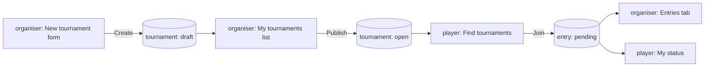
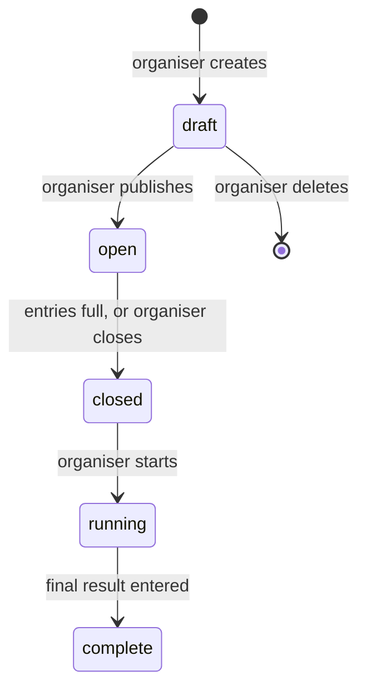

# The plan artifact — pictures the owner reviews before anything is built

One page. Every flow drawn, every screen wireframed, every lifecycle as a state diagram. This
is the review surface; the project skill is the record. The owner looks at *this*, and the
confirm command is at the bottom of it.

## Where it goes

**Publish it as an artifact** where the Artifact tool exists — a private page with a link the
owner opens. Artifacts render Mermaid natively (`<pre class="mermaid">` blocks), so every
diagram below is Mermaid and nothing needs a library.

**Otherwise write `.flow/plan/index.html`** and tell the owner to open it. Load Mermaid from
`https://cdn.jsdelivr.net/npm/mermaid@11/dist/mermaid.min.js` with a `<script>` tag and call
`mermaid.initialize({ startOnLoad: true })`. Either way the page is self-contained.

## What it contains, in order

**1. In the owner's words.** The intent record's quote, as a blockquote, first. Everything
below it is the plan's reading of that quote, and the owner should see the two side by side.

**2. The process flows — one diagram each.** A Mermaid flowchart, left to right, one node per
state, with the actor on the edge and **the screen where the person sees the result as the
terminal node.** A flow that ends in a database table and not a screen is a flow with a gap,
and the diagram makes that visible in a way three lines of text does not:

Every write node is a cylinder; every screen node is a rectangle with the role in it. **If a
cylinder has no rectangle after it, say so under the diagram** rather than fixing it silently
— it is a finding for the owner.

**3. The screens — a wireframe per job.** Deliberately low-fidelity: grey boxes, real labels,
no colour, no typeface choice, a single system font. Each wireframe is the screen a person
lands on *after* the job's action, because that is the one that was missing. Show:

- the real navigation labels, so the owner can say "we would never call it that"
- the real field names on any form, so a missing field is visible
- the empty state — what the screen says when there is nothing yet — because most screens
  are first seen empty
- the list or detail the created thing appears in

Plain HTML and CSS, one `<section>` per screen, a caption naming the job it serves. Keep them
grey on purpose: **the moment a wireframe carries a palette, the owner reviews the look
instead of the workflow.** The look is `/flow:theme`'s job, later.

**4. Entities and lifecycles — a state diagram each.**

A state with no outgoing edge that is not terminal is a state with no exit. A transition with
no actor on it is a step with no actor. Both are visible here and invisible in prose.

**5. The boundaries** — one diagram, modules and the arrows between them, nothing inside them.

**6. What it is not.** The exclusions, as a plain list. The owner should be able to say "wait,
I did want that."

**7. The decisions.** Each one the owner was asked, the options, and what they chose — so the
record of the choice sits next to the flows the choice shaped.

**8. The confirm command.** Last, and set apart:

> If this is the product you want, run:
> `echo <hash> > .flow/plan-confirmed`
>
> If it is not, say what is wrong — the skill changes, the hash changes, and you confirm the
> corrected version.

The hash is `sha256` of `.claude/skills/<project>/SKILL.md`, first twelve hex characters —
the same value the plan gate prints when it denies. Compute it after the skill is final.

## Keep it honest

- **Every screen in the artifact appears in the skill's jobs, and every job has a screen.** A
  mismatch is a gap the artifact just found; fix the skill, not the picture.
- **No screen that the plan does not deliver.** A wireframe of something in "what it is not"
  is a promise the owner will remember.
- **Say what the experts disagreed on**, in the decisions section, rather than showing one
  clean answer. The owner chose; the artifact shows what they chose between.
- **Do not style it.** Grey, system font, one column. It is a drawing, not a design.
